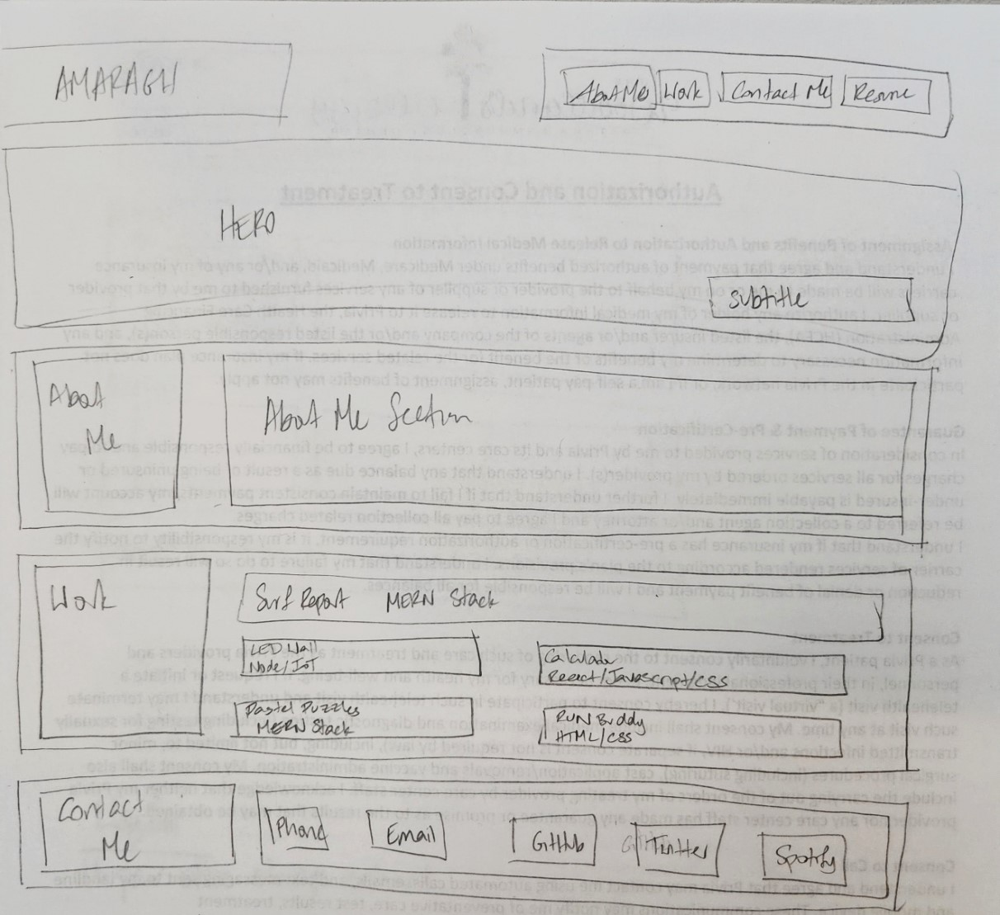

# Portfolio Build using HTML and CSS

## Description

A portfolio is necessary for any programmer who wishes to showcase their coding skills to the public, especialy potential employers. Such a portfolio will allow the programmer to provide an attractive landing page where they can include any details they find important for a potential employer to know. In addition to providing links to their most impressive work, they can provide more human details about themself and show off their design skills as well.

I created a portfolio using the HTML, CSS and general coding skills I have learned so far to build a framework for the work I have done so far, and for any noteworthy future projects I execute. 

## Installation

N/A

## Usage

The deployed application can be found [here](https://amaragh.github.io/THIS IS INCOMPLETE/).

### Wireframe
The below screenshot shows an initial pass at wireframing the layout as it would be depicted on a normal desktop computer. The final result varies slightly but the structure was built based on this design.

## Credits

N/A

## License

Please refer to the license in the repo.

