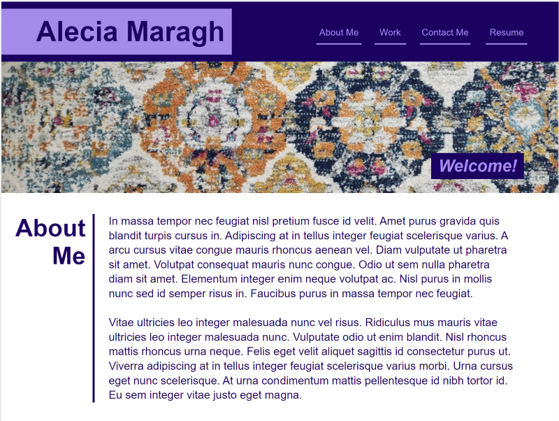
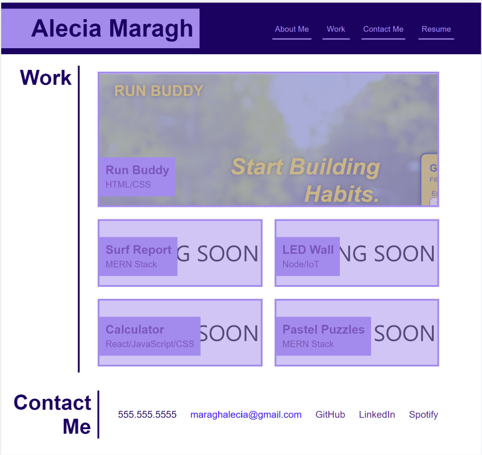
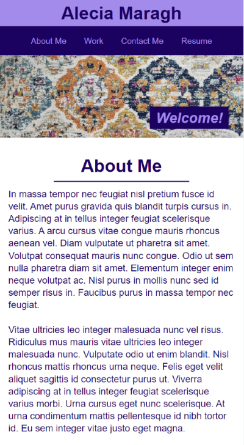
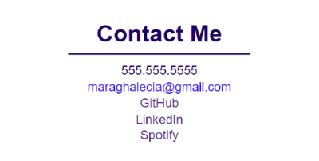

# Portfolio Build using HTML and CSS

## Description

A portfolio is necessary for any programmer who wishes to showcase their coding skills to the public, especialy potential employers. Such a portfolio will allow the programmer to provide an attractive landing page where they can include any details they find important for a potential employer to know. In addition to providing links to their most impressive work, they can provide more human details about themself and show off their design skills as well.

I created a portfolio using the HTML, CSS and general coding skills I have learned so far to build a framework for the projects I have completed, and for any noteworthy future projects I execute. This was a fun project as I got to build my first webpage from scratch, and it was also a good exercise in interatively tailoring the HTML to the CSS as I progressed through the build.

## Installation

N/A

## Usage
Flexboxes are used throughout the code to allow more seamless integration between the elements on the page as the width changes. Other CSS tools are used throughout the webpage, such as variables, pseudo-elements, and media queries. Please explore the HTML and CSS files for further technical details.

The webpage was built first to render normally on screen greater than 980px wide, then media queries were introduced to the CSS to accomodate screens with smaller widths.

Chrome DevTools was used extensively throughout testing and was also used for sourcing screenshots of the application as if they were displayed on other devices.

The deployed application can be found [here](https://amaragh.github.io/portfolio/).  
 
This section includes some large screenshots so navigational links to relevant sections have been provided below:

- [Larger Screens](#larger-screens)
- [Smaller Desktop Screens](#smaller-desktop-screens)
- [Tablets](#tablets)
- [Mobile Phones](#mobile-phones)
- [Wireframe](#wireframe)

  ### Larger Screens
  The two below screenshots comprise the website as rendered on a typical desktop screen. This layout matches the wireframe most closely.

  
  
  
  ### Smaller Desktop Screens
  The two below screenshots comprise the website as rendered on a smaller desktop screen.

  
  
  
  ### Tablets
  The two below screenshots comprise the website as rendered on a tablet or other smaller screen.

  
  
  
  ### Mobile Phones
  The below screenshots comprise the website as rendered on a mobile phone. A few differences as we size even further down include the header spanning the full width of the screen, and the details of the contact information section now stacking vertically.

  

  

  
  
  ### Wireframe
  The below screenshot shows an initial pass at wireframing the layout as it would be depicted on a normal desktop computer. The final result varies slightly but the structure was built based on this design.

  

## Credits

N/A

## License

Please refer to the license in the repo.

